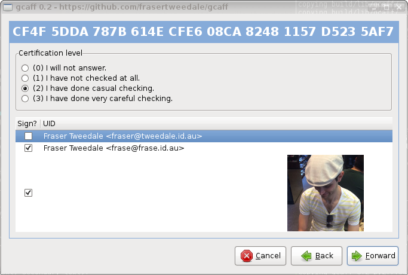

``gcaff`` is a graphical tool for signing OpenPGP keys.  Its main
use case is for signing many keys at once, after a keysigning party
for example.

Features include:

* display photo IDs and select for signing
* sign with multiple signing keys in one pass
* choose the certification level on a per-key basis
* email each signature separately, only to the associated email
  address

Differences from ``caff``
-------------------------

``gcaff`` is inspried by caff_, a command-line signing assistant.
Apart from ``caff`` being a CLI program and ``gcaff`` having a GUI,
there are some important differences:

* ``gcaff`` does not remove uids from keys.  ``caff`` sends only the
  uid that was signed to each email address.  ``gcaff`` sends all
  uids, but only one uid will have the new signature.

* ``gcaff`` sends signatures for photo uids or uids without an email
  address to *all email addresses* on the key.  Signatures on
  regular uids are sent to the corresponding email address only.

* ``gcaff`` has no pinentry mechanism; users must have a working
  ``gpg-agent`` to use ``gcaff``.

* ``gcaff`` requires the user to supply a file containing keys to be
  signed; no keys are fetched from keyservers.

.. _caff: http://pgp-tools.alioth.debian.org/

Cryptographic concerns
----------------------

``gcaff`` signs keys using the SHA256 digest.  Future work could
allow users to choose a different digest for signing.  Patches are
welcome!

**Secret keys are never exported** from the GnuPG home directory,
however, the corresponding public keys are exported to a temporary
GnuPG keyring during the signing process.

No keys in the user's GnuPG home directory are modified during the
signing process.  Once signing is complete, all the signatures are
written to a file whose location is reported.  The user may
(manually) import keys from this file into her regular keyring.  A
future version could offer to perform this step for the user.
Contributions are welcome.

Dependencies
------------

* GnuPG and gpg-agent
* Python 2.7
* PyGTK >=2, <3
* a local mailer (SMTP), e.g. sendmail

Debian / Ubuntu
^^^^^^^^^^^^^^^

Install Python 2.7 and PyGTK in the normal way for your operating
system.  Note that on many systems PyGTK cannot be installed with
``pip``.

To install dependencies on a Debian or Ubuntu system (or other
systems using APT)::

  sudo apt-get install gnupg gnupg-agent postfix

If ``gnupg-agent`` was not previously installed you will probably
need to log out and log in again to ensure that ``gpg-agent`` is
running and the appropriate environment variables are set.

During the postfix configuration dialog ensure you select **Internet
Site** as the "General type of mail configuration".  If postfix is
not accepting mail you can run the configuration again::

  sudo dpkg-reconfigure postfix

Fedora
^^^^^^

Fedora 20 and later releases do not have an MTA installed by
default.  To install and configure::

  sudo yum install -y postfix
  sudo systemctl start postfix
  sudo systemctl enable postfix

Installation
------------

To install for all users, on a Unix system::

  sudo pip install gcaff

To perform an installation to user site-packages::

  pip install gcaff --user

Ensure that the user site ``bin/`` directory is on the ``PATH`` if
installing to user site-packages.

Usage
-----

::

    gcaff --keyring keys-to-sign.asc

License
-------

``gcaff`` is free software: you can redistribute it and/or modify
it under the terms of the GNU General Public License as published by
the Free Software Foundation, either version 3 of the License, or
(at your option) any later version.

Contributing
------------

Bug reports, general feedback, patches and translations are welcome.

A list of desirable enhancements can be found in the file
``TODO.rst``.

To submit a patch, please use ``git send-email`` or generate a
pull/merge request.  Write a `well formed commit message`_.  If your
patch is nontrivial, add a copyright notice (or, if appropriate,
update an existing notice) at the top of each file added or changed.

.. _well formed commit message: http://tbaggery.com/2008/04/19/a-note-about-git-commit-messages.html
